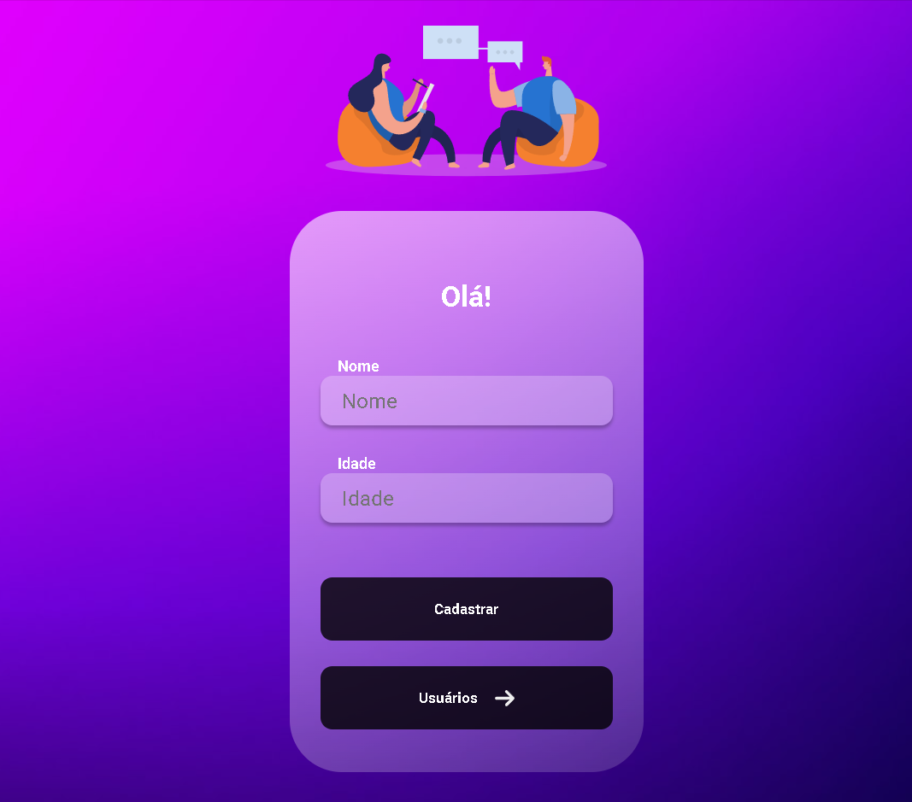

<h1 align="center">Create User React</h1>

<h3 align="center">
  Front-End
</h3>

## 🏠 About the project

Projeto do curso Dev-Club para React e Node para aprender a usar front-end e backend juntamente com professor Rodolfo Mori.
 

## 🖥️ Technologies

[React]  

## Contributors

We thank the following people who contributed to this project:

<table>
  <tr>
    <td align="center">
      <a href="#">
         
        
          <b>Luan Rebuli</b>
        
      </a>
    </td>
  </tr>

</table>
